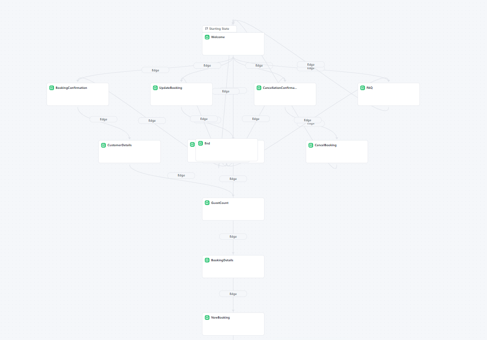
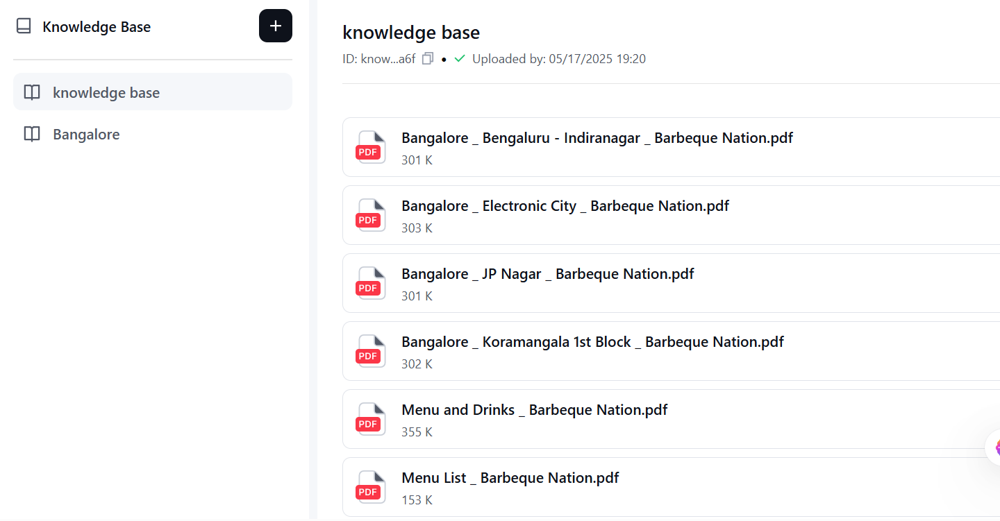
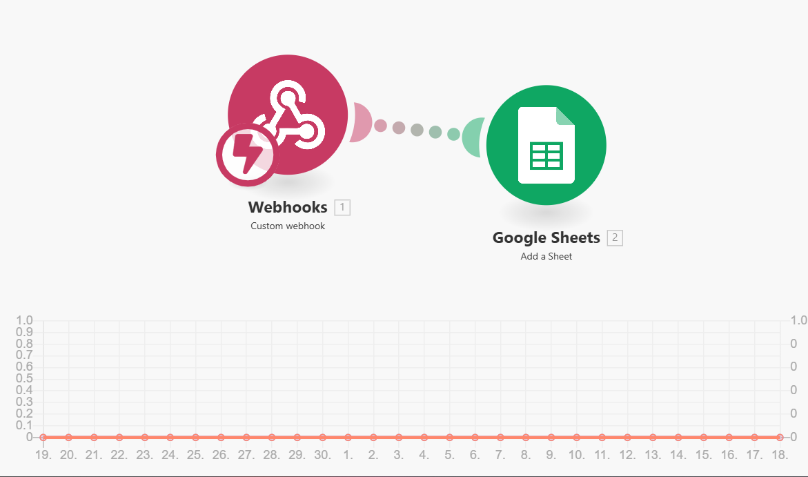
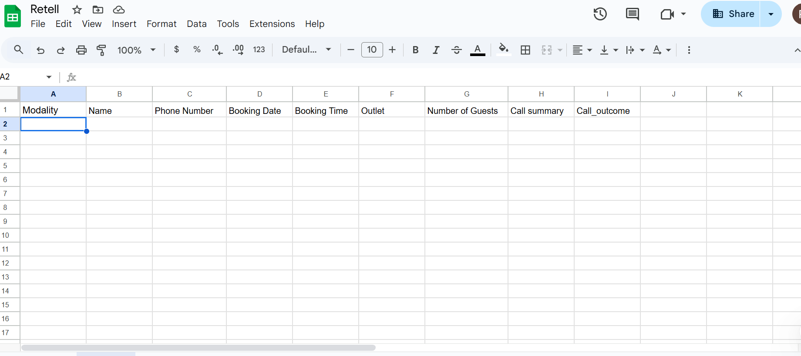

Barbeque Nation Chatbot (Retell AI Integration)

A conversational AI agent for Barbeque Nation that handles bookings, FAQs, updates/cancellations, and logs all details to Google Sheets using Retell AI and Make.

## Table of Contents
- [Overview](#overview)
- [Architecture](#architecture)
- [Features](#features)
- [Usage](#usage)
- [Component Links](#component-links)
- [API Documentation](#api-documentation)
- [Screenshots](#screenshots)
- [Contact](#contact)

## **Key Features**

- **Conversational Booking Flow**  
  Seamlessly guides users through booking, updating, or cancelling reservations via natural chat or voice, collecting all necessary details (date, time, guests, contact info, outlet/property).

- **Automated Scheduling & Availability Checks**  
  Instantly checks available slots, confirms bookings, and can reschedule or cancel appointments as needed-all without human intervention[2].

- **Knowledge Base Integration**  
  Answers FAQs and property-specific questions using uploaded documents (PDFs, DOCs), ensuring users get accurate, context-aware information[1][3].

- **Real-Time Data Logging to Google Sheets**  
  Every booking, update, or cancellation is logged automatically in Google Sheets using Make, enabling live tracking and easy business analytics[6][14].

- **No-Code Workflow Automation**  
  All integrations (Retell AI to Google Sheets) are built with Make (Integromat), requiring no custom code and allowing for rapid updates and scalability[6].

- **Post-Call/Interaction Analysis**  
  Extracts and logs key details (name, phone, booking info, call outcome) after each conversation for reporting and follow-up[14].

- **Multi-Channel Support**  
  Works across chat and phone/voice, supporting both web and telephony users with the same intelligent agent[1][3].

- **Error Handling & Fallbacks**  
  Handles incomplete or ambiguous queries gracefully, provides clear fallback responses, and ensures users always have a way to continue or get help.

- **Customizable Prompts & Branding**  
  Prompts, confirmation messages, and fallback responses can be tailored to match your business’s tone and requirements[5].

- **Secure & Scalable**  
  All data transfers are secure, and the system can handle high call/chat volumes without loss of performance[3][6].

chatbot demo - https://agency-bp0r74.chat-dash.com/prototype/68293df0079fdb17d56d4232

### How to Use
1. Open the chatbot link or call the phone number.
2. Follow the prompts to make a booking, ask a question, or update/cancel a reservation.
3. Provide the requested details (name, phone, date, time, outlet, etc.).
4. Receive confirmation and details from the agent.
5. All interactions are logged automatically in Google Sheets for business analysis.

## Component Links

- **Knowledge Base API Endpoints:** [Insert your API or Retell AI KB link]
- **Post-Call Analysis Sheet:** [Insert your Google Sheets link]
- **Chatbot Link:** [Insert your Retell AI agent or web demo link]
- **Agent Linked Phone Number:** [+91 XXXXXXXXXX] (if using voice)

API Documentation
This API powers the Barbeque Nation chatbot’s core features: knowledge base retrieval, booking creation, booking update, and booking deletion. All endpoints are RESTful and accept/return JSON.

1. Knowledge Base Query
Endpoint: /api/knowledge

Method: POST

Description: Retrieve relevant knowledge base chunks for a user query, ensuring each response is under 800 tokens.

Request Body:

json
{
  "query": "What is the buffet timing at JP Nagar?",
  "location": "Bangalore"
}
Response:

json
{
  "chunks": [
    "The buffet at JP Nagar is available from 12:00 PM to 3:30 PM for lunch and 7:00 PM to 11:00 PM for dinner."
  ],
  "continuation_token": null
}
Errors:

404 Not Found – No relevant information found.

400 Bad Request – Missing or invalid parameters.

2. Create Booking
Endpoint: /api/bookings

Method: POST

Description: Save a new booking with all required details.

Request Body:

json
{
  "name": "Aryamann Sharma",
  "phone": "9876543210",
  "date": "2025-05-20",
  "time": "19:30",
  "outlet": "JP Nagar",
  "guests": 4
}
Response:

json
{
  "status": "success",
  "booking_id": "BK123456",
  "message": "Booking confirmed for Aryamann Sharma at JP Nagar on 2025-05-20 at 19:30 for 4 guests."
}
Errors:

409 Conflict – Slot not available.

400 Bad Request – Missing or invalid parameters.

3. Update Booking
Endpoint: /api/bookings/{booking_id}

Method: PUT

Description: Update an existing booking by ID.

Request Body:

json
{
  "date": "2025-05-21",
  "time": "20:00",
  "guests": 5
}
Response:

json
{
  "status": "success",
  "message": "Booking BK123456 updated to 2025-05-21 at 20:00 for 5 guests."
}
Errors:

404 Not Found – Booking ID not found.

400 Bad Request – Invalid update parameters.

4. Delete (Cancel) Booking
Endpoint: /api/bookings/{booking_id}

Method: DELETE

Description: Cancel a booking by ID.

Response:

json
{
  "status": "success",
  "message": "Booking BK123456 has been cancelled."
}
Errors:

404 Not Found – Booking ID not found.

Error Handling
All errors return a JSON object with status, error_code, and message.

json
{
  "status": "error",
  "error_code": "404",
  "message": "Booking ID not found."
}

## Screenshots

### 1. Retell AI Conversation Flow

### 2. Knowledge Base Upload

### 3. Make Scenario

### 4. Google Sheets Logging

## Contact

For questions, feedback, or support, contact [issa.23052005@gmail.com] or open an issue in this repository.

- GitHub: [sharmilapadhy23](https://github.com/sharmilapadhy23)
- LinkedIn: [sharmila padhy](https://www.linkedin.com/in/sharmila-padhy-60a82b251/)
